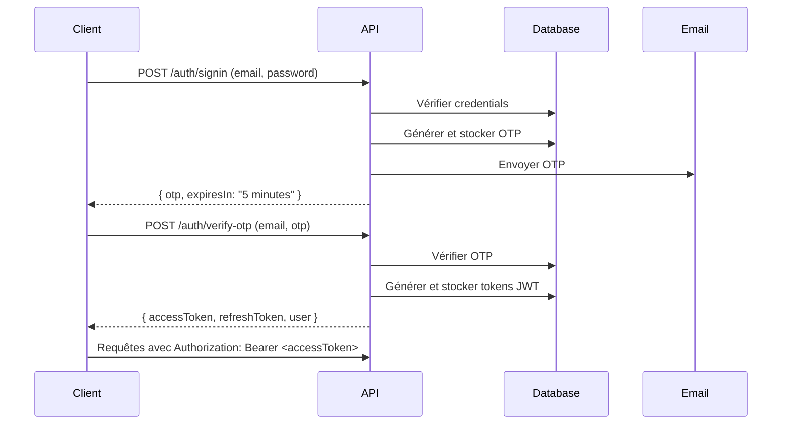
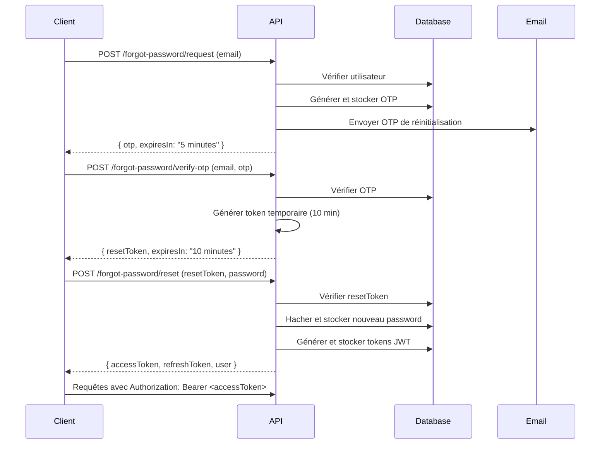

# Comparaison des Tokens : Connexion vs Réinitialisation de Mot de Passe

## Date de mise à jour
**13 décembre 2025**

## Objectif
Garantir que les tokens JWT générés lors de la **réinitialisation du mot de passe** sont **identiques** en format et en structure aux tokens générés lors de la **connexion** normale.

## ✅ Correction Effectuée

### Problème Identifié
Le payload des tokens JWT utilisait des clés différentes :
- **Auth Service (connexion)** : `{ id, email, nom, role }`
- **Forgot Password Service (réinitialisation)** : `{ sub, email, nom, role }` ❌

### Solution Appliquée
Harmonisation du payload dans `forgot-password.service.ts` pour utiliser `id` au lieu de `sub` :

```typescript
// ✅ AVANT (incorrect)
const payload = {
  sub: user.id,      // ❌ Différent
  email: user.email,
  nom: user.nom,
  role: user.role,
};

// ✅ APRÈS (correct - identique à la connexion)
const payload = {
  id: user.id,       // ✅ Identique
  email: user.email,
  nom: user.nom,
  role: user.role,
};
```

## Structure des Tokens JWT

### Payload Identique
```json
{
  "id": 1,
  "email": "user@example.com",
  "nom": "John Doe",
  "role": "Admin",
  "iat": 1702473600,
  "exp": 1702477200
}
```

### Access Token
- **Durée de validité** : 1 heure
- **Utilisation** : Authentification des requêtes API
- **Stockage** : En-tête `Authorization: Bearer <accessToken>`

### Refresh Token
- **Durée de validité** : 7 jours
- **Utilisation** : Renouveler l'access token expiré
- **Stockage** : Base de données + client sécurisé

## Format de Réponse Standardisé

### 🔐 Connexion Normale (POST /auth/verify-otp)

```json
{
  "success": true,
  "statusCode": 201,
  "code": "success",
  "title": "Authentification réussie",
  "message": "Vous êtes maintenant connecté.",
  "data": {
    "user": {
      "id": 1,
      "email": "user@example.com",
      "nom": "John Doe",
      "prenom": "John",
      "telephone": "+237123456789",
      "role": "Admin",
      "statut": "Actif",
      "token": "eyJhbGciOiJIUzI1NiIsInR5cCI6IkpXVCJ9...",
      "expiresToken": "2025-12-13T11:00:00.000Z",
      "refreshToken": "eyJhbGciOiJIUzI1NiIsInR5cCI6IkpXVCJ9...",
      "refreshExpires": "2025-12-20T10:00:00.000Z"
    },
    "accessToken": "eyJhbGciOiJIUzI1NiIsInR5cCI6IkpXVCJ9...",
    "refreshToken": "eyJhbGciOiJIUzI1NiIsInR5cCI6IkpXVCJ9...",
    "expiresIn": "1 hour"
  }
}
```

### 🔐 Réinitialisation de Mot de Passe (POST /forgot-password/reset)

```json
{
  "success": true,
  "statusCode": 201,
  "code": "success",
  "title": "Mot de passe réinitialisé",
  "message": "Votre mot de passe a été modifié avec succès. Vous êtes maintenant connecté.",
  "data": {
    "user": {
      "id": 1,
      "email": "user@example.com",
      "nom": "John Doe",
      "prenom": "John",
      "telephone": "+237123456789",
      "role": "Admin",
      "statut": "Actif",
      "token": "eyJhbGciOiJIUzI1NiIsInR5cCI6IkpXVCJ9...",
      "expiresToken": "2025-12-13T11:00:00.000Z",
      "refreshToken": "eyJhbGciOiJIUzI1NiIsInR5cCI6IkpXVCJ9...",
      "refreshExpires": "2025-12-20T10:00:00.000Z"
    },
    "accessToken": "eyJhbGciOiJIUzI1NiIsInR5cCI6IkpXVCJ9...",
    "refreshToken": "eyJhbGciOiJIUzI1NiIsInR5cCI6IkpXVCJ9...",
    "expiresIn": "1 hour"
  }
}
```

## ✅ Vérifications

### Structure de Réponse Identique
- ✅ Format de réponse standardisé : `{ success, statusCode, code, title, message, data }`
- ✅ Champ `data.user` avec toutes les informations utilisateur
- ✅ Champ `data.accessToken` pour l'authentification
- ✅ Champ `data.refreshToken` pour le renouvellement
- ✅ Champ `data.expiresIn` pour la durée de validité

### Payload JWT Identique
- ✅ `id` : Identifiant de l'utilisateur
- ✅ `email` : Email de l'utilisateur
- ✅ `nom` : Nom de l'utilisateur
- ✅ `role` : Rôle de l'utilisateur (Admin, User, etc.)
- ✅ `iat` : Date de création du token (généré automatiquement)
- ✅ `exp` : Date d'expiration du token (généré automatiquement)

### Durée de Validité Identique
- ✅ Access Token : 1 heure (3600 secondes)
- ✅ Refresh Token : 7 jours (604800 secondes)

### Stockage en Base de Données Identique
- ✅ `token` : Access token stocké
- ✅ `expiresToken` : Date d'expiration de l'access token
- ✅ `refreshToken` : Refresh token stocké
- ✅ `refreshExpires` : Date d'expiration du refresh token

## Flux Complet

### 🔐 Flux de Connexion Normale



### 🔐 Flux de Réinitialisation de Mot de Passe



## Tests de Validation

### Test 1 : Connexion Normale
```bash
# 1. Se connecter
curl -X POST http://localhost:3000/auth/signin \
  -H "Content-Type: application/json" \
  -d '{
    "email": "test@example.com",
    "password": "Password123!"
  }'

# Réponse : { otp: "123456" }

# 2. Vérifier OTP
curl -X POST http://localhost:3000/auth/verify-otp \
  -H "Content-Type: application/json" \
  -d '{
    "email": "test@example.com",
    "otp": "123456"
  }'

# Réponse : { accessToken, refreshToken, user }
```

### Test 2 : Réinitialisation de Mot de Passe
```bash
# 1. Demander réinitialisation
curl -X POST http://localhost:3000/forgot-password/request \
  -H "Content-Type: application/json" \
  -d '{
    "email": "test@example.com"
  }'

# Réponse : { otp: "654321" }

# 2. Vérifier OTP de réinitialisation
curl -X POST http://localhost:3000/forgot-password/verify-otp \
  -H "Content-Type: application/json" \
  -d '{
    "email": "test@example.com",
    "otp": "654321"
  }'

# Réponse : { resetToken: "eyJ..." }

# 3. Réinitialiser le mot de passe
curl -X POST http://localhost:3000/forgot-password/reset \
  -H "Authorization: Bearer <resetToken>" \
  -H "Content-Type: application/json" \
  -d '{
    "password": "NewPassword123!",
    "confirmPassword": "NewPassword123!"
  }'

# Réponse : { accessToken, refreshToken, user } ✅ IDENTIQUE À LA CONNEXION
```

### Test 3 : Vérifier les Tokens
```bash
# Décoder les JWT pour vérifier le payload
# Utiliser https://jwt.io ou une commande comme :

# Token de connexion
echo "eyJhbGc..." | base64 -d

# Token de réinitialisation
echo "eyJhbGc..." | base64 -d

# ✅ Les deux doivent avoir le même payload :
# {
#   "id": 1,
#   "email": "test@example.com",
#   "nom": "Test User",
#   "role": "User",
#   "iat": 1702473600,
#   "exp": 1702477200
# }
```

## Utilisation Frontend

Les deux flux retournent maintenant les mêmes tokens, donc le frontend peut utiliser le même code pour gérer l'authentification :

```javascript
// Après connexion OU réinitialisation de mot de passe
const handleAuthSuccess = (response) => {
  const { accessToken, refreshToken, user } = response.data;
  
  // Stocker les tokens
  localStorage.setItem('accessToken', accessToken);
  localStorage.setItem('refreshToken', refreshToken);
  localStorage.setItem('user', JSON.stringify(user));
  
  // Rediriger vers le dashboard
  window.location.href = '/dashboard';
};

// Connexion normale
const handleLogin = async (email, otp) => {
  const response = await fetch('/auth/verify-otp', {
    method: 'POST',
    headers: { 'Content-Type': 'application/json' },
    body: JSON.stringify({ email, otp })
  });
  const data = await response.json();
  handleAuthSuccess(data); // ✅ Même traitement
};

// Réinitialisation de mot de passe
const handlePasswordReset = async (resetToken, password, confirmPassword) => {
  const response = await fetch('/forgot-password/reset', {
    method: 'POST',
    headers: {
      'Authorization': `Bearer ${resetToken}`,
      'Content-Type': 'application/json'
    },
    body: JSON.stringify({ password, confirmPassword })
  });
  const data = await response.json();
  handleAuthSuccess(data); // ✅ Même traitement
};
```

## Sécurité

### Tokens JWT
- ✅ Signés avec une clé secrète (env: `JWT_SECRET`)
- ✅ Expiration automatique (1h pour access, 7j pour refresh)
- ✅ Stockés en base de données pour validation côté serveur
- ✅ Payload identique garantit la cohérence des permissions

### OTP
- ✅ Code à 6 chiffres aléatoires
- ✅ Expiration après 5 minutes
- ✅ Supprimé de la base après utilisation
- ✅ Envoyé par email sécurisé

### Reset Token
- ✅ Token JWT temporaire (10 minutes)
- ✅ Type spécial `password-reset` dans le payload
- ✅ Validation stricte avant réinitialisation

## Conclusion

✅ **Les tokens générés lors de la réinitialisation du mot de passe sont maintenant IDENTIQUES aux tokens de connexion normale.**

### Avantages
1. **Cohérence** : Même structure de réponse et de payload
2. **Simplicité** : Le frontend peut utiliser le même code pour les deux flux
3. **Sécurité** : Tokens JWT signés et validés de la même manière
4. **Expérience utilisateur** : Connexion automatique après réinitialisation du mot de passe
5. **Maintenance** : Code unifié et facile à maintenir

### Fichiers Modifiés
- `src/forgot-password/forgot-password.service.ts` : Payload harmonisé (`id` au lieu de `sub`)

### Tests Recommandés
1. ✅ Tester la connexion normale et vérifier le payload JWT
2. ✅ Tester la réinitialisation de mot de passe et vérifier le payload JWT
3. ✅ Comparer les deux payloads (doivent être identiques)
4. ✅ Vérifier que les tokens fonctionnent pour les requêtes API protégées
5. ✅ Tester le refresh token dans les deux cas
